

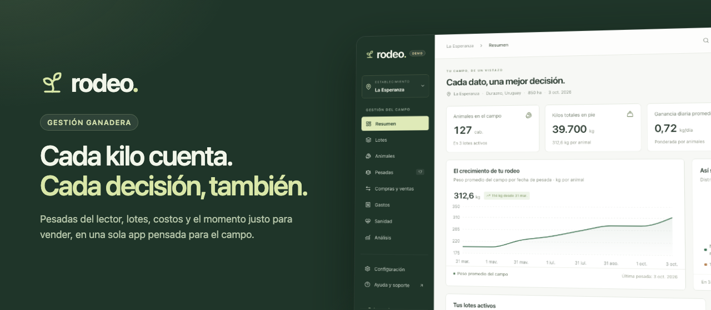

# Rodeo

### Cada kilo cuenta. Cada decisión, también.

 

 

**Rodeo pone en un solo lugar todo lo que pasa en tu campo:** las pesadas que salen del lector de caravanas, lo que gastás, lo que comprás y vendés y cómo viene cada lote. Está hecha para productores ganaderos, sus encargados y sus asesores. En vez de juntar planillas, abrís la app y sabés **cuánto engorda tu rodeo, cuánto te cuesta cada kilo y cuándo te conviene vender**.

 

## ✨ Lo que vas a poder hacer

<table>
<tr>
<td width="50%" valign="top">

### ⚖️ Pesadas en minutos, no en tardes
Subís el Excel de la balanza y Rodeo te muestra solo lo que necesita tu ojo: caravanas nuevas, repetidas, saltos de peso o un sexo que no coincide. El resto entra solo.

</td>
<td width="50%" valign="top">

### 📈 Sabé cuánto engorda cada lote
Ganancia diaria real, tendencia de las últimas pesadas y los días que faltan para llegar al peso objetivo. Sin calculadora.

</td>
</tr>
<tr>
<td valign="top">

### 💰 El costo sigue al animal
La compra, los gastos del lote y la parte de los gastos del campo quedan cargados en cada cabeza. Sabés cuánto te cuesta cada kilo producido y cuál es tu precio de equilibrio.

</td>
<td valign="top">

### 🤝 ¿Vender hoy o esperar?
Movés la fecha, el precio o el costo diario y ves el margen al instante, con un escenario de precio ±10 %. Llegás a la negociación con números.

</td>
</tr>
<tr>
<td valign="top">

### 🐄 Cada animal, con su historia
Pesos, sanidad, movimientos, lote, propietario con su DICOSE y prenda bancaria, todo en una sola ficha. Buscás la caravana y listo.

</td>
<td valign="top">

### 🍼 El rodeo de cría bajo control
Entores, tactos, preñeces y partos estimados. Rodeo te avisa antes de cada parto y te marca las vacas que siguen sin diagnóstico.

</td>
</tr>
<tr>
<td valign="top">

### 💉 Sanidad sin sustos
Cada tratamiento calcula su período de retiro y frena la venta de un animal que todavía no está habilitado. Además, te recuerda la próxima dosis.

</td>
<td valign="top">

### 📊 El mercado te llega solo
Todos los lunes entran solos los promedios de ACG: la reposición en pie y el gordo en cuarta balanza. Los ves al lado de tu costo, sin tocar un botón.

</td>
</tr>
<tr>
<td valign="top">

### 👥 Todo el equipo, cada uno en su lugar
El encargado carga pesadas y sanidad sin ver plata. La contadora consulta todo sin poder cambiar nada. Vos decidís quién ve qué.

</td>
<td valign="top">

### 📶 Funciona aunque no haya señal
Lo que cargás en la manga queda guardado en el celular y se sincroniza solo cuando volvés a tener conexión.

</td>
</tr>
<tr>
<td valign="top">

### 🏡 Varios campos, una sola cuenta
Pasás de un establecimiento a otro en un clic y movés animales entre campos con su historia y su costo.

</td>
<td valign="top">

### 📑 Excel e informes, listos
Exportás animales, pesadas, movimientos y gastos a Excel, y el cierre de cada lote sale en un informe listo para imprimir.

</td>
</tr>
</table>

 

## 👀 Así se ve

**El campo de un vistazo:** animales, kilos, ganancia diaria, gastos y alertas.

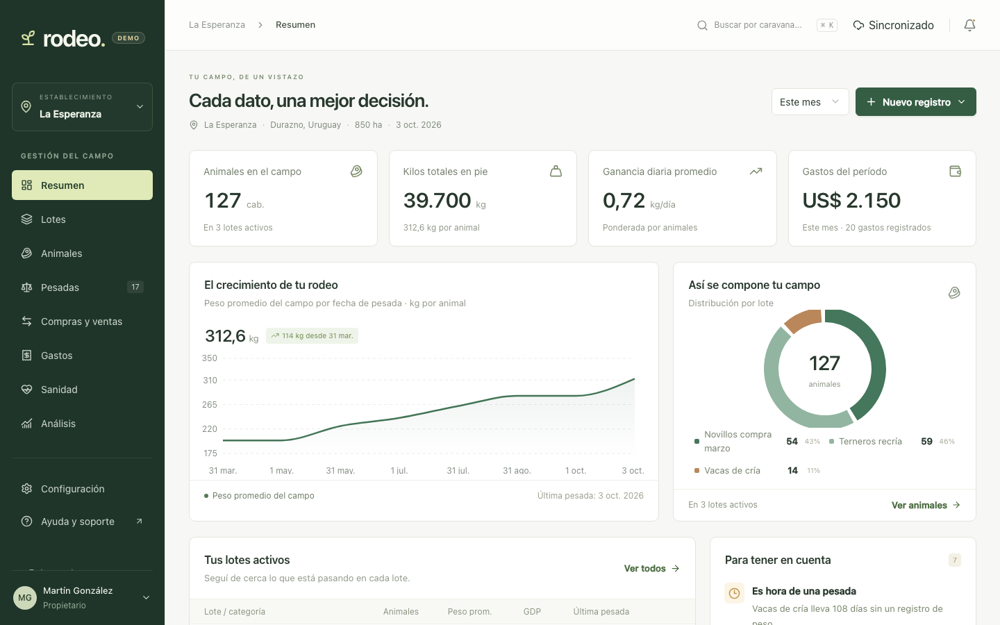

 

<table>
<tr>
<td width="50%" align="center">
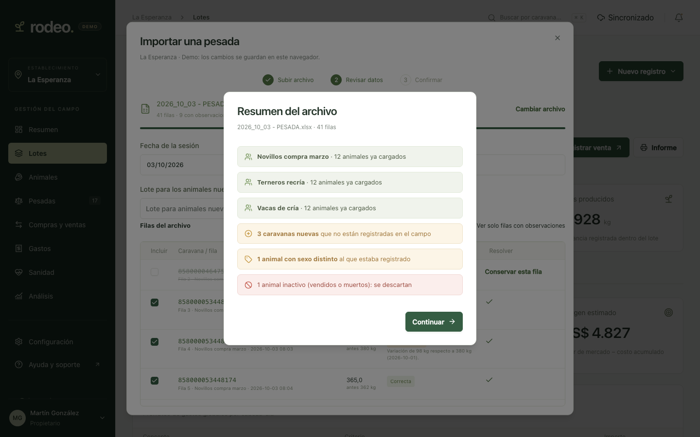
 <b>Pesadas del lector</b> Antes de guardar, sabés qué trae el archivo.
</td>
<td width="50%" align="center">
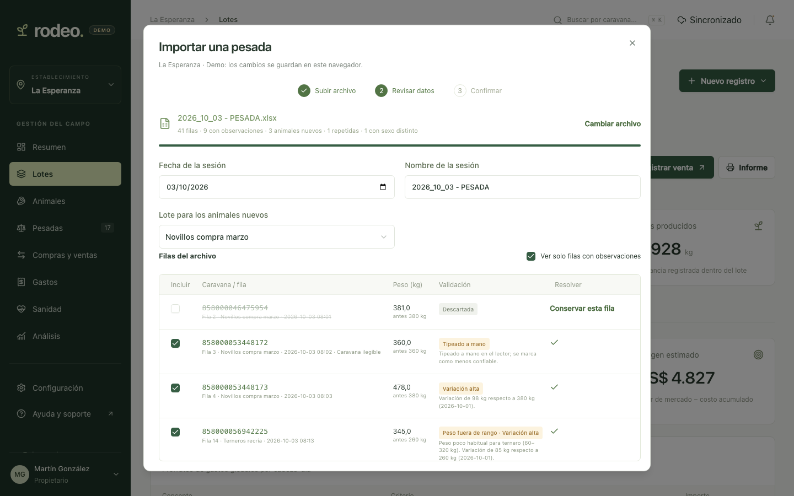
 <b>Revisión fila por fila</b> Solo revisás las filas con observaciones.
</td>
</tr>
<tr>
<td align="center">
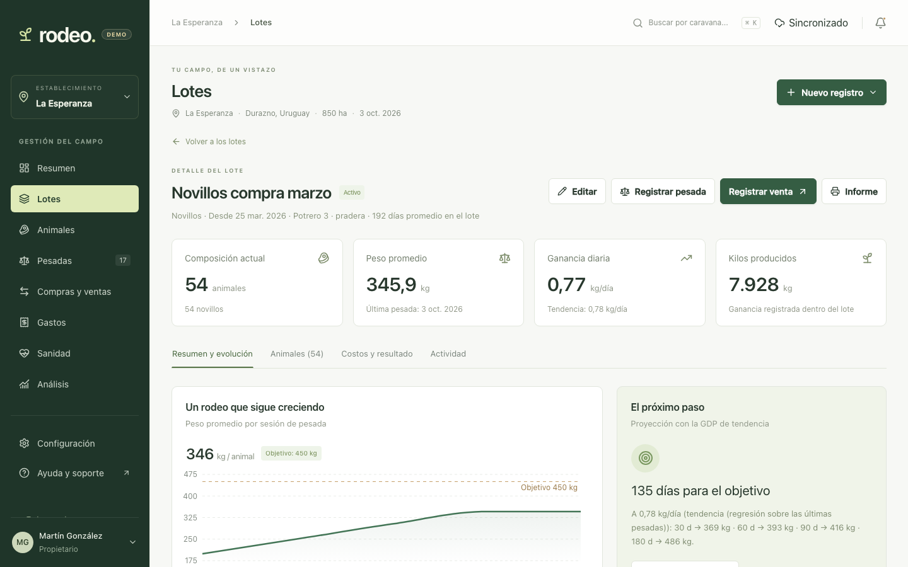
 <b>Cada lote, en perspectiva</b> Evolución del peso y días hasta el objetivo.
</td>
<td align="center">
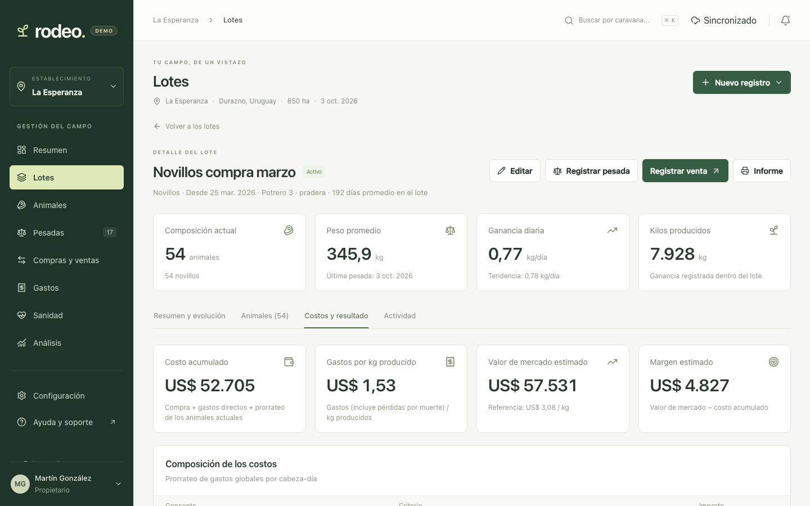
 <b>Costos y margen estimado</b> Lo que llevás invertido y lo que vale hoy.
</td>
</tr>
<tr>
<td align="center">
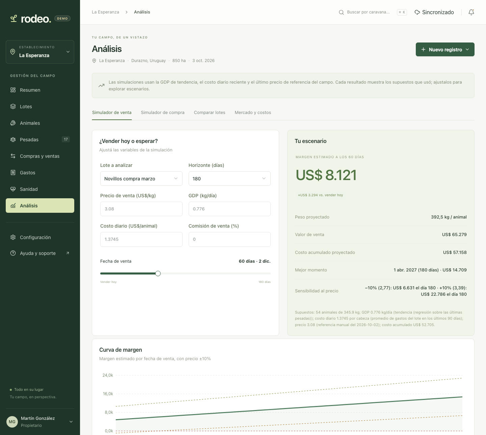
 <b>¿Vender hoy o esperar?</b> El mejor momento, con sensibilidad al precio.
</td>
<td align="center">
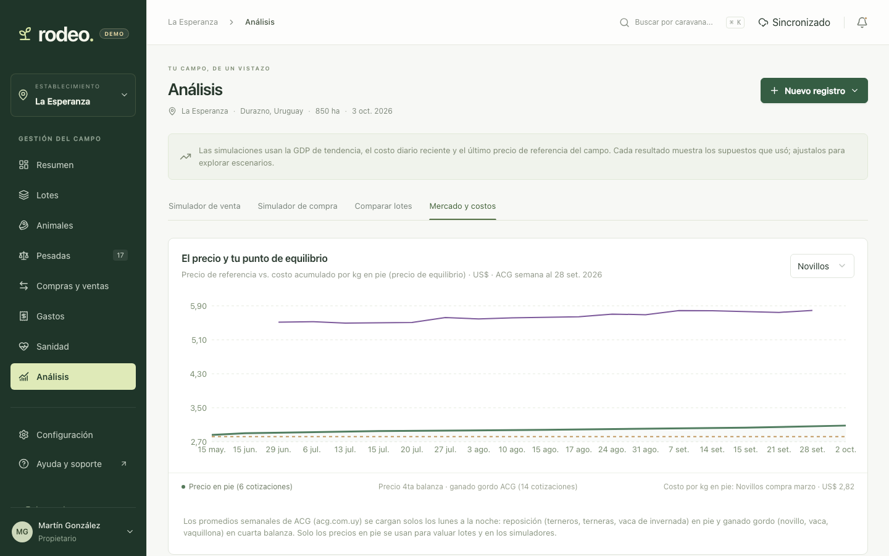
 <b>Mercado contra tu costo</b> Precios de ACG frente a tu precio de equilibrio.
</td>
</tr>
<tr>
<td align="center">
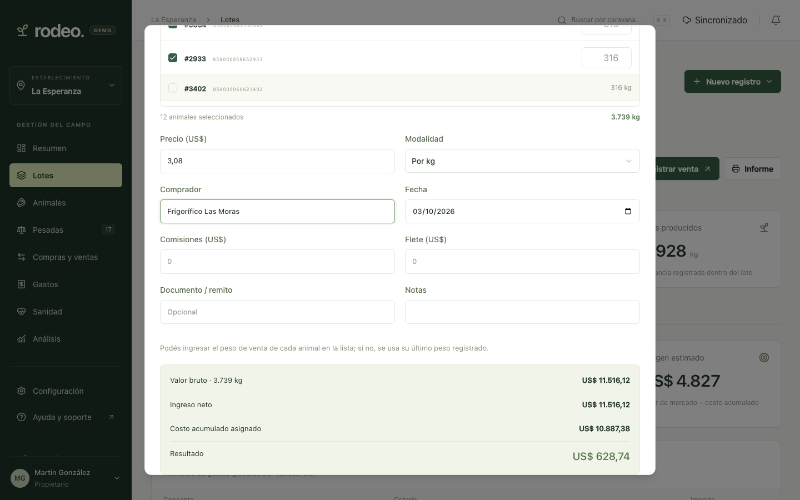
 <b>Ventas con el resultado a la vista</b> Antes de confirmar, sabés cuánto ganás.
</td>
<td align="center">
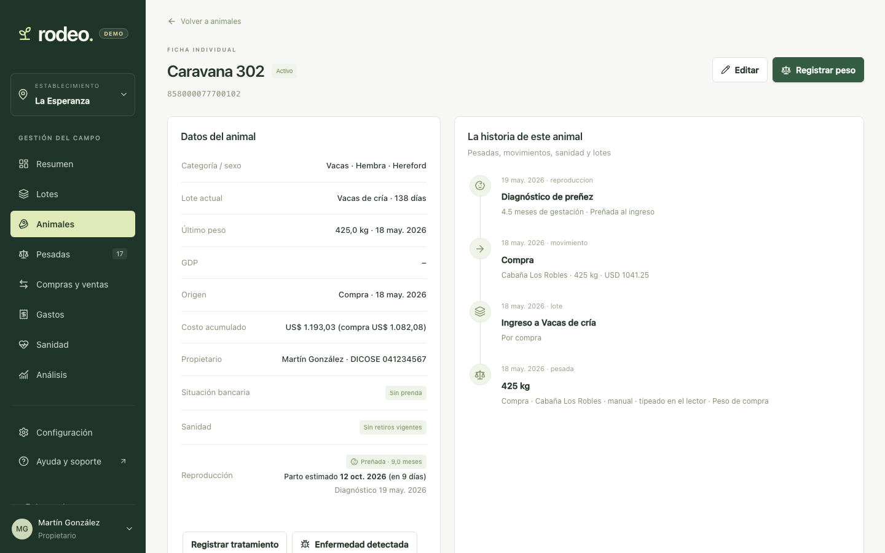
 <b>La ficha de cada animal</b> Preñez, parto estimado, dueño y toda su historia.
</td>
</tr>
<tr>
<td align="center">
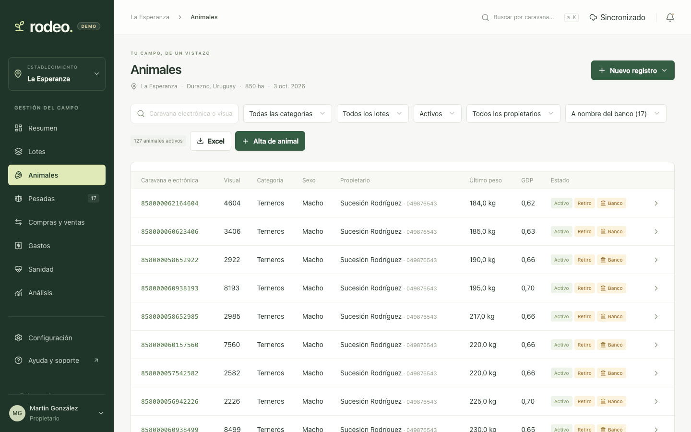
 <b>Filtrá en segundos</b> Preñadas, en entore, con retiro o prendadas al banco.
</td>
<td align="center">
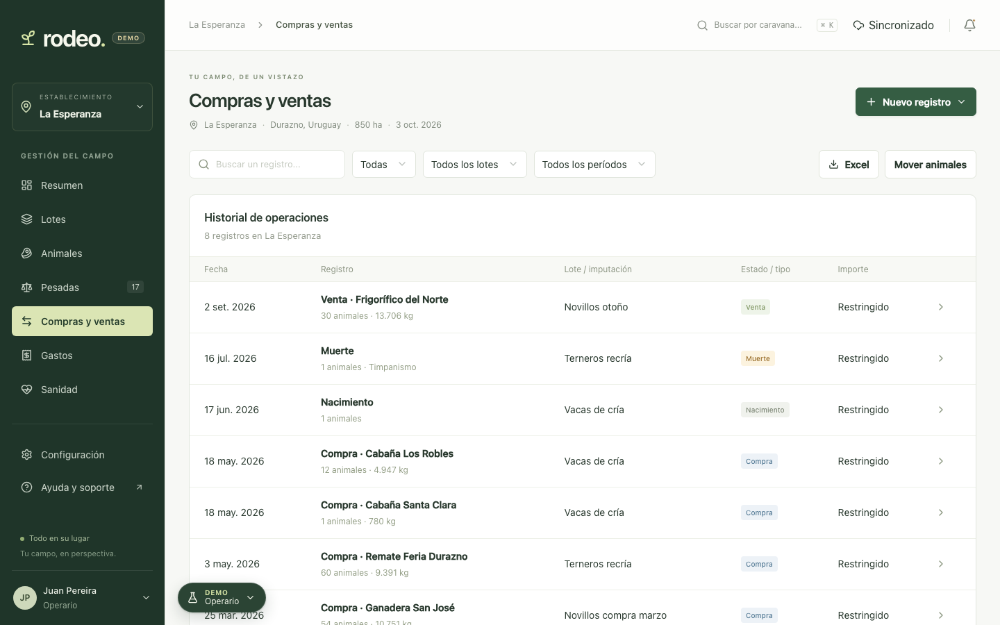
 <b>Cada rol ve lo suyo</b> El encargado trabaja sin ver los montos.
</td>
</tr>
</table>

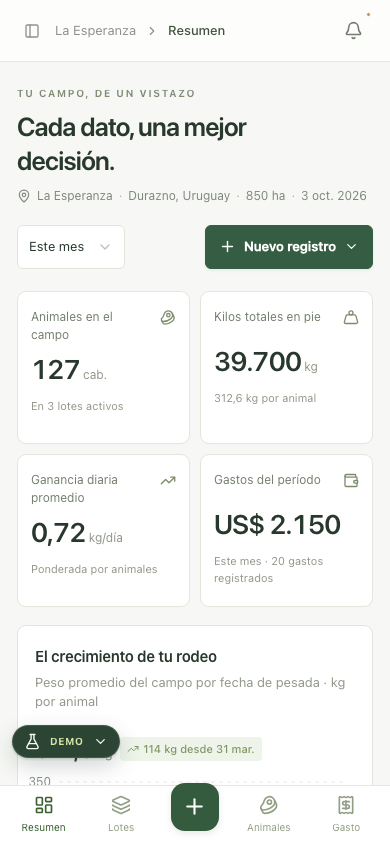
 <b>En el bolsillo, en la manga y en la oficina.</b>

 

## 🎯 ¿Para quién es?

| | Perfil | Lo que gana con Rodeo |
|:-:|---|---|
| 🤠 | **Productor y dueño del campo** | El resultado de cada lote sin armar planillas, y números claros para decidir cuándo comprar y cuándo vender. |
| 🧑‍💼 | **Administración del establecimiento** | El equipo, los gastos, los precios y las alertas ordenados en un solo lugar, para uno o varios campos. |
| 🧑‍🌾 | **Encargado y personal de campo** | Cargar pesadas, sanidad y movimientos desde el celular en un minuto, aunque no haya señal. |
| 🧮 | **Contador, veterinario o asesor** | Ver costos, resultados y la historia sanitaria siempre al día, sin pedir planillas ni tocar nada. |
| 🤝 | **Socios y capitalizadores** | Saber qué animales son de cada propietario por DICOSE y cuáles quedaron a nombre del banco. |

 

## 🚀 Probala en 3 minutos

La demo tiene un campo de ejemplo en Durazno, con lotes, pesadas reales del lector, ventas, gastos y un rodeo de cría. **No tenés que registrarte:** entrás con un clic como alguno de estos perfiles.

| Entrá como… | Para ver… |
|---|---|
| 👨‍🌾 **Martín**, el productor | Todo: costos, márgenes, simuladores, compras y ventas. |
| 👩‍💼 **Sofía**, la administradora | La gestión del campo y del equipo. |
| 🧑‍🔧 **Juan**, el encargado | La carga diaria, sin montos. |
| 👩‍💻 **Carolina**, la contadora | La información completa, en modo consulta. |

<table>
<tr>
<td width="50%" align="center">
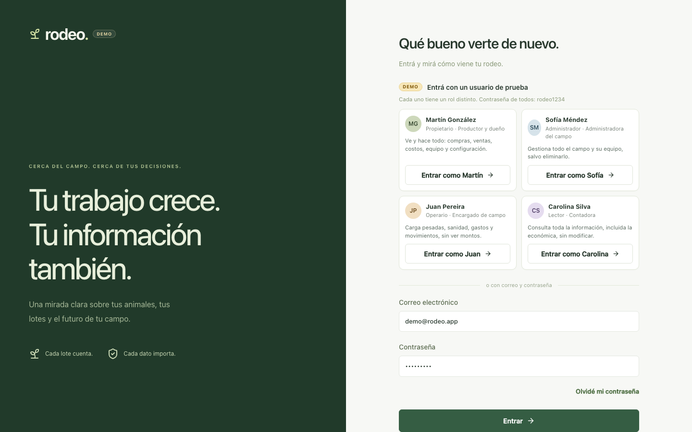
 <b>Un clic y estás adentro</b>
</td>
<td width="50%" align="center">
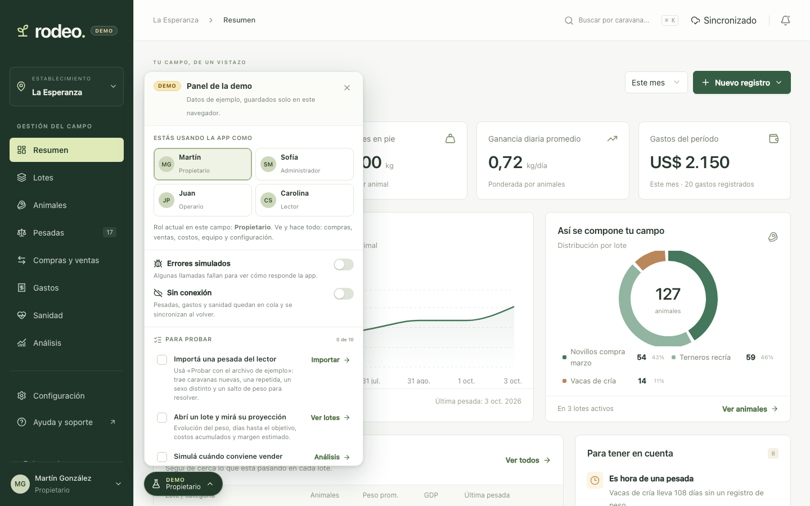
 <b>El panel de la demo</b> Cambiá de rol, cortá la conexión y seguí la guía.
</td>
</tr>
</table>

Algunas ideas para arrancar:

1. **Importá una pesada** con el archivo de ejemplo y resolvé lo que te marca.
2. **Abrí un lote** y mirá cuántos días le faltan para el peso objetivo.
3. **Simulá una venta** y buscá el mejor momento para vender.
4. **Cortá la conexión** desde el panel de la demo, cargá un peso y mirá cómo se sincroniza al volver.
5. **Cambiá de rol** y fijate qué ve cada persona del equipo.

> Todo lo que cargues queda solo en tu navegador. Podés empezar de cero cuando quieras con «Reiniciar demo».

 

## Tu campo, en perspectiva.

**Menos planillas, más campo.** Probá Rodeo con datos de ejemplo y mirá lo que puede hacer por tu establecimiento.

¿Querés usarla en tu campo o que la veamos juntos? Escribinos a **CORREO_DE_CONTACTO**.

Hecho para los que viven el campo. 🇺🇾

